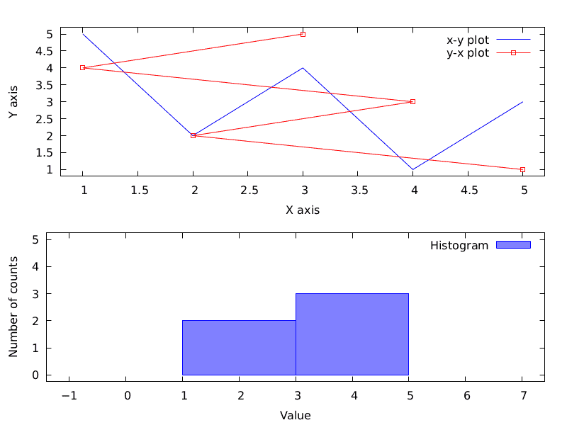
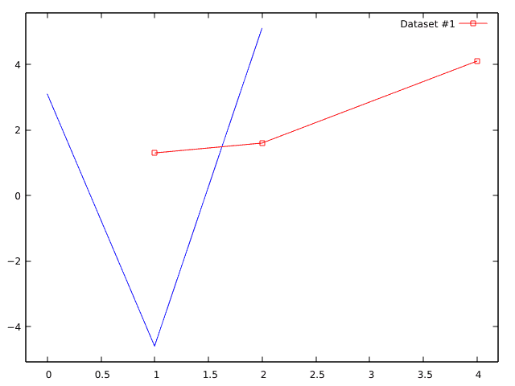
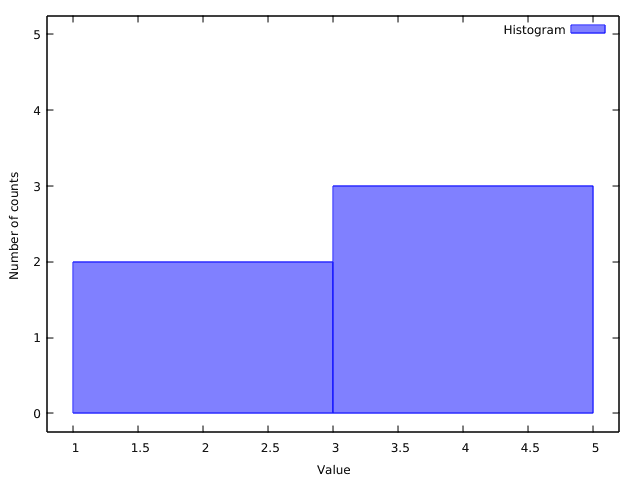
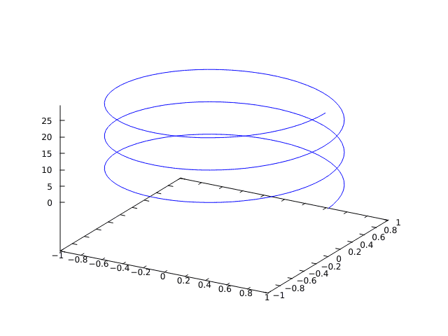

# gplot++

[](https://github.com/ziotom78/gplotpp/actions?query=workflow%3Amake-checks)
[](https://opensource.org/licenses/MIT)

A header-only C++ interface to Gnuplot.

This repository contains the file `gplot++.h`, which provides a way
for C++ programs to connect to a Gnuplot instance to produce plots. To
use this library, you must first install
[Gnuplot](http://www.gnuplot.info/) on your system!

A few features of this library are the following:

- Header-only library: very easy to install
- Plot `std::vector` variables
- Multiple series in the same plot
- Multiple plots (via `Gnuplot::multiplot`)
- Logarithmic axes (via `Gnuplot::set_logscale`)
- Histograms (via `Gnuplot::histogram`)
- Custom ranges (via `Gnuplot::set_xrange` and `Gnuplot::set_yrange`)
- Possibility to save the plots in PNG and PDF files
- 3D plots (**new in 0.2.0**)

## Installing the library

Just download the file
[gplot++.h](https://raw.githubusercontent.com/ziotom78/gplotpp/master/gplot%2B%2B.h)
and save it in the same folder as your program. That's all. (Of
course, you must have Gnuplot installed and available in the
`PATH`.)

## Examples

Here is the output of one of the examples:



The source code of the example is in file `example-complex.cpp`:

```c++
#include "gplot++.h"

int main(void) {
  Gnuplot plt{};
  std::vector<double> x{1, 2, 3, 4, 5}, y{5, 2, 4, 1, 3};

  // Save the plot into a PNG file with the desired size (in pixels)
  plt.redirect_to_png("complex.png", "800,600");

  /* Create two plots with the following layout (2 rows, 1 column):
   *
   * +------------------------+
   * |                        |
   * |        Plot #1         |
   * |                        |
   * +------------------------+
   * |                        |
   * |        Plot #2         |
   * |                        |
   * +------------------------+
   */
  plt.multiplot(2, 1, "Title");

  // Plot #1
  plt.set_xlabel("X axis");
  plt.set_ylabel("Y axis");
  plt.plot(x, y, "x-y plot");
  plt.plot(y, x, "y-x plot", Gnuplot::LineStyle::LINESPOINTS);
  plt.show(); // Always call "show"!

  // Plot #2
  plt.set_xlabel("Value");
  plt.set_ylabel("Number of counts");
  plt.histogram(y, 2, "Histogram");
  plt.set_xrange(-1, 7);
  plt.set_yrange(0, 5);
  plt.show(); // Always call "show"!
}
```

## Documentation

### Initializing a connection to Gnuplot

The only symbol exported by file `gplot++.h` is the `Gnuplot` class.
When you instance an object of this class, it will silently start
`gnuplot` in the background and open a pipe through it:

```c++
#include "gplot++.h"

int main() {
    Gnuplot plt{};
    
    // ...
}
```

If Gnuplot is not available in your `PATH` (probably this is most common on Windows system), you can specify the full path to the executable:

```c++
#include "gplot++.h"

int main() {
    Gnuplot plt{R"(C:\Program Files\Gnuplot\gnuplot.exe)"};
    
    // ...
}
```

The connection will be automatically closed once the variable `plt`
goes out of scope; by default, the Gnuplot window will be left open.
In this way, you can navigate through the Gnuplot window even after
your C++ has completed its execution.

### Plot commands

There are two ways to produce a plot; both require you to call the
`Gnuplot::plot` method:

1. Pass one `std::vector` variable, which will be used to set the `y`
   coordinates of the points;
2. Pass two `std::vector` variables; these will be used to set the
   `(x, y)` coordinates of the points.

You can call `plot` multiple times, and each time your call will be
recorded in a list. When you are ready to produce a plot, call
`Gnuplot::show`, like in the following example:

several ways to produce a plot. Each of them requires you to
pass the data to plot through one or more `std::vector` variables:

```c++
std::vector<int> x{1, 2, 4};  // No problem to use a vector of ints
std::vector<double> y1{3.1, -4.6, 5.1};
std::vector<double> y2{1.3, 1.6, 4.1};

Gnuplot plt{};
// Just pass the set of y values
plt.plot(y1);

// You can provide a label and a linestyle
plt.plot(x, y2, "Dataset #1", Gnuplot::LineStyle::LINESPOINTS);

// Now produce the plot
plt.show();
```




### Histograms

Gplot++ implements the method `Gnuplot::histogram`, which computes the
histogram of a series and plot it using Gnuplot. Here is an example
(`example-histogram.cpp`):

```c++
#include "gplot++.h"

int main(void) {
  Gnuplot gnuplot{};
  std::vector<double> x{1, 2, 3, 4, 5}, y{5, 2, 4, 1, 3};

  gnuplot.histogram(y, 2, "Histogram");

  gnuplot.set_xlabel("Value");
  gnuplot.set_ylabel("Number of counts");
  gnuplot.set_xrange(1, 5);
  gnuplot.set_yrange(0, 5);

  gnuplot.show();
}
```



The parameters to `Gnuplot::histogram` are the following:

- A vector containing the values to use in the plot;
- The number of bins to plot (two bins in the example above);
- A label for the plot (optional, default is empty)
- The line style (optional, default is `Gnuplot::LineStyle::BOXES`)


### Line styles

There are several line styles:

-   `Gnuplot::LineStyle::DOTS` (only use this when you have many points);
-   `Gnuplot::LineStyle::LINES` (the default);
-   `Gnuplot::LineStyle::POINTS`;
-   `Gnuplot::LineStyle::LINESPOINTS`;
-   `Gnuplot::LineStyle::STEPS`;
-   `Gnuplot::LineStyle::BOXES` (only used for histograms).


### Styling the plot axes

You can manually assign a range to the X and Y axes using the methods
`Gnuplot::set_xlabel` and `Gnuplot::set_ylabel`:

```c++
Gnuplot plt{};

plt.set_xrange(1.5, 3.5);
plt.set_yrange(); // No parameters means automatic axes
```

If you are creating multiple plots (see below), you should probably
reset the x and y ranges after each call to `Gnuplot::show`.

You can also provide a label for both axes:

```c++
plt.set_xlabel("Time [s]");
plt.set_ylabel("Speed [cm/s]");
```

### Logarithmic scale

To set a logarithmic scale, use `Gnuplot::set_logscale`:

```c++
Gnuplot plt{};

plt.set_logscale(Gnuplot::AxisScale::LOGXY);
```

Possible parameters are:

- `Gnuplot::AxisScale::LINEAR` (the default);
- `Gnuplot::AxisScale::LOGX`;
- `Gnuplot::AxisScale::LOGY`;
- `Gnuplot::AxisScale::LOGXY`.


### Multiple plots

You can make several plots within the same window using the method
`Gnuplot::multiplot`. It accepts the following parameters:

- The number of rows to use;
- The number of columns to use;
- A title (optional, default is no title).

You must paint the several plot in order, and each time you complete
one plot you must call `Gnuplot::show`.


### 3D plots

You can create 3D plots using the command `plot3d`, which takes
*three* vectors. See the file `example-3d.cpp`:

```c++
#include "gplot++.h"
#include <cmath>
#include <iostream>

int main(void) {
  Gnuplot gnuplot{};
  std::vector<double> x, y, z;

  for (double angle = 0; angle < 6 * M_PI; angle += 0.1) {
    x.push_back(cos(angle));
    y.push_back(sin(angle));
    z.push_back(angle / 2 * M_PI);
  }

  gnuplot.plot3d(x, y, z);
  gnuplot.show();
}
```

Here is the result:



### Saving plots to a file

It is often useful to save the plot into a file, instead of opening a
window. You can save plots in PNG format if you call the method
`Gnuplot::redirect_to_png`:

```c++
Gnuplot plt{};

// Call this immediately after you constructed the object "plt"
plt.redirect_to_png("image.png", "800,600");
```

The first parameter is the name of the image file to create, and the
second is a string specifying the size of the image, in the format
`width,height` (in pixels). If you avoid passing the second parameter,
a sensible default will be used:

```c++
Gnuplot plt{};

// Use the default size
plt.redirect_to_png("image.png");
```

You can save the plot in a PDF file, which should be the preferred
format if you plan to include the plot in a LaTeX document:

```c++
Gnuplot plt{};

// Call this immediately after you constructed the object "plt"
plt.redirect_to_pdf("image.pdf", "20cm,15cm");
```

Unlike `Gnuplot::redirect_to_png`, when you create a PDF file you can
use several measure units to specify the size of the image. In this
case too, you can avoid passing the second parameter, and a reasonable
default will be used.


### Low-level interface

You can pass commands to Gnuplot using the method `Gnuplot::sendcommand`:

```c++
Gnuplot plt{};

plt.sendcommand("set xlabel 'X axis'");
plt.sendcommand("plot sin(x)");
```

## Similar libraries

There are several other libraries like gplot++ around. These are the
ones I referenced while developing my own's:

-   [gnuplot-iostream](https://github.com/dstahlke/gnuplot-iostream):
    it has much more features than gplot++, but it is slightly more
    difficult to install and use.
-   [gnuplot-cpp](https://github.com/martinruenz/gnuplot-cpp): another
    header-only library. It lacks support for high-level stuff like
    `std::vector` plotting.

## Changelog

### v0.2.1

-   Ensure that commands sent to Gnuplot are executed immediately
    ([#1](https://github.com/ziotom78/gplotpp/pull/1))

### v0.2.0

-   New constants `GNUPLOTPP_VERSION`, `GNUPLOTPP_MAJOR_VERSION`,
    `GNUPLOTPP_MINOR_VERSION`, and `GNUPLOTPP_PATCH_VERSION`
-   3D plots (after a suggestion by William Luciani)

### v0.1.0

- First release
